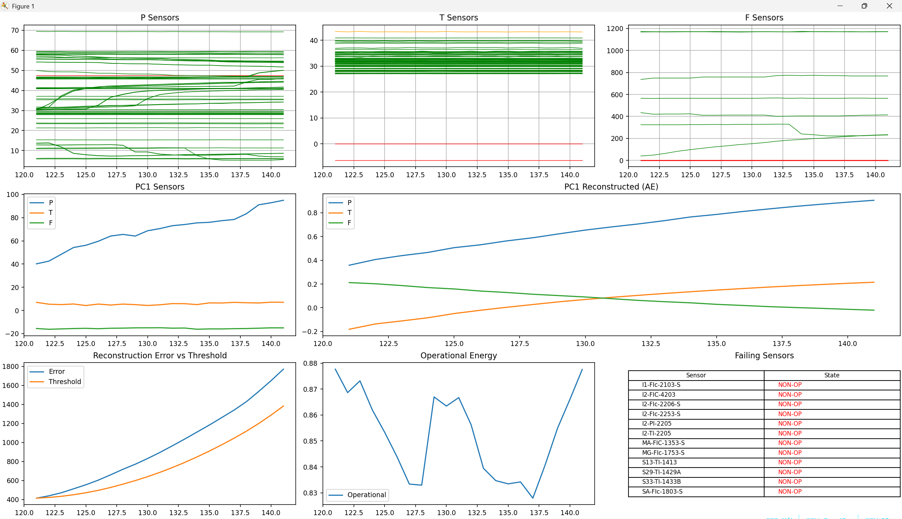

# Pipeline Multi-Dimensional Anomaly Detection Engine



## Overview

This repository implements a real-time, streaming, multi-layer anomaly detection system for industrial pipeline sensor data.

The system combines:

- Sensor classification
- Static (cold-start) sensor filtering
- Peer-to-peer spatial deviation detection
- PCA-based spatial compression
- LSTM Autoencoder temporal modeling
- Adaptive thresholding
- Structured logging
- Optional real-time visualization dashboard

It operates on streaming multivariate sensor data and produces:

- Sensor-level fault detection
- System-level anomaly detection
- Operational-aware thresholding
- Wide-format and long-format logs

---

## System Architecture
```
Raw Streaming CSV  
    ↓  
Sensor Classification  
    ↓  
Cold Start Static Filtering  
    ↓  
Peer Deviation Detection (Spatial)  
    ↓  
Per-Group PCA Compression  
    ↓  
Temporal LSTM Autoencoder  
    ↓  
Adaptive Thresholding  
    ↓  
Final Decision Engine  
    ↓  
Structured Logging (+ Optional Dashboard)
```
---

## Data Format

Input is a streaming CSV structured as:

Seconds,Timestamp_IST,<sensor_1>,<sensor_2>,...,<sensor_n>

Sensors include:

- Pressure sensors (PI, PIC)
- Temperature sensors (TI, TIC)
- Flow sensors (FI, FIC)
- Operational sensors (MOV, PUMP, SCR, XXI, DRA, SBV, TYPE, MP, etc.)

---

## Configuration Parameters

Defined in `core/config.py`:

- DATA_PATH: Path to input CSV
- COLD_START: Number of samples used for static detection
- AE_SEQ_LEN: Temporal window length for LSTM
- PEER_Z: Z-threshold for peer deviation

---

## Phase-by-Phase Breakdown

### 1. Sensor Classification

Sensors are grouped by keyword matching:

MAIN_SENSORS = {
    "P": ["PI", "PIC"],
    "T": ["TI", "TIC"],
    "F": ["FI", "FIC"]
}

OP_KEYS = ["MOV", "PUMP", "SCR", "XXI", "DRA", "SBV", "TYPE", "MP"]

Output:

groups = {
    "P": [...],
    "T": [...],
    "F": [...],
    "OP": [...]
}

---

### 2. Cold Start Static Detection

For the first COLD_START samples:

For each sensor:

std = standard_deviation(first N samples)

If:

std ≈ 0

Sensor is marked:

NON-OPERATIONAL

and excluded from PCA and temporal modeling.

Purpose:

- Prevent PCA corruption
- Avoid false anomalies
- Remove frozen or dead sensors

---

### 3. Peer-to-Peer Deviation (Spatial Detection)

Within each group (P, T, F):

At time t:

m = median(values)  
MAD = median(|xi - m|)  
z_i = |xi - m| / MAD  

If:

z_i > PEER_Z

Sensor is flagged as:

DEVIATING

This detects:

- Drift
- Bias
- Miscalibration
- Isolated sensor spikes

This is spatial detection only.

---

### 4. Per-Group PCA Compression

Each group may contain many correlated sensors.

Instead of modeling all sensors directly:

Pressure sensors → PC1_P  
Temperature sensors → PC1_T  
Flow sensors → PC1_F  

At time t:

z(t) = [PC1_P, PC1_T, PC1_F]

Dimensionality reduces from ~150+ sensors to 3 dominant physical modes.

---

### 5. Temporal Modeling (LSTM Autoencoder)

Input:

Window size = AE_SEQ_LEN  
Shape: (L, 3)

LSTM learns temporal evolution of:

[PC1_P, PC1_T, PC1_F]

Reconstruction:

recon = model(window)

Reconstruction error:

E(t) = MSE(window, recon)

High E(t) indicates deviation from learned dynamics.

---

## Engine Modes

### Mode A — Baseline + Frozen Model (Stable)

1. Collect baseline windows
2. Train LSTM once
3. Freeze model
4. Fit operational regression
5. Perform inference only

Pros:
- Stable thresholds
- Clear anomaly separation
- Production-friendly

Cons:
- Requires clean baseline period

---

### Mode B — Fully Online Adaptive

- No baseline phase
- LSTM trains continuously
- Threshold adapts using EMA

Adaptive threshold:

ema_mean ← running mean of E(t)  
ema_var ← running variance  
θ(t) = ema_mean + 3 * sqrt(ema_var)

Pros:
- Immediate operation
- No baseline delay
- Adapts to gradual drift

Cons:
- May learn persistent anomalies
- Less stable than frozen baseline

---

## Operational Energy (Optional Enhancement)

Operational sensors can influence system dynamics.

Operational energy proxy:

O(t) = mean(|operational sensors|)

This can be used to:

- Model E(t) ≈ α·O(t) + β
- Create context-aware threshold θ(t)

Helps distinguish:

- True leak-like anomalies
- Legitimate operational changes

---

## Logging

Two output formats:

1. Wide Format  
   One row per timestep  
   One column per sensor state  

2. Long Format  
   t, sensor, state  

Sensor states:

- HEALTHY
- NON-OPERATIONAL
- DEVIATING

---

## Performance Notes

Headless engine (no dashboard) runs significantly faster.

Visualization mode introduces overhead due to:

- Matplotlib redraw
- Autoscaling
- Table rendering

For maximum throughput:

- Use headless main
- Disable plotting
- Run on GPU if available

---

## Limitations

- No explicit concept drift detection
- No topology-aware modeling
- No causal inference
- Online mode may absorb persistent anomalies
- Assumes sufficient correlation within groups for PCA

---

## Summary

This system implements layered anomaly detection:

1. Structural filtering (static detection)
2. Spatial validation (peer deviation)
3. Dimensional compression (PCA)
4. Temporal modeling (LSTM)
5. Adaptive thresholding
6. Decision routing
7. Structured logging

It is designed for streaming industrial sensor data with modular architecture and configurable operation modes.
